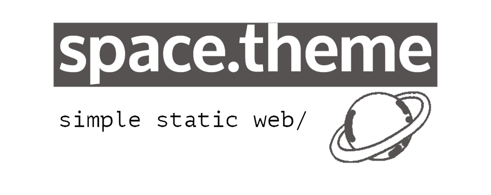
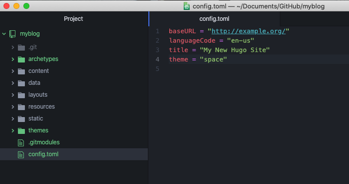

## Features
Features in the ori.:

* Simple and easy to customize
* Concentrated on reading and writing (find a Markdown editor then) experience
Mobile-friendly & widescreen-friendly
* Flexible commenting control
Features in this ported version:

* Add Gitalk and Valine intergration.
* Customizable color scheme. (Some bug in original version, fixed.)
* Firefox-friendly. (CSS issue in original version, fixed.)

## Getting started
*If your website is using Git as version control, please do as follows:

1. Fetch the theme dir.

open your hugo website, then run the terminal:

```
git submodule add https://github.com/FajarBaiz/hugo-theme-space.git themes/space
```
2. then open config.toml in our hugo website dir, add the ``theme = "space"``



3. Finally, run:

```
hugo server -D
```
## Creating a blog post
```
hugo new blog/:blog-post.md
```

``blog-post.md`` is the name of the file of your new post.

will be saved in the ``content/posts/:blog-post.md``

## Configuring the Home Page
```
---
title: "blog-post"
date: 2020-08-20
Description: ""
tags:
- sharing
- motivational
- self-reminder
---

```
## Screenshot


# DEMO
[https://fajars.space](https://fajars.space)
